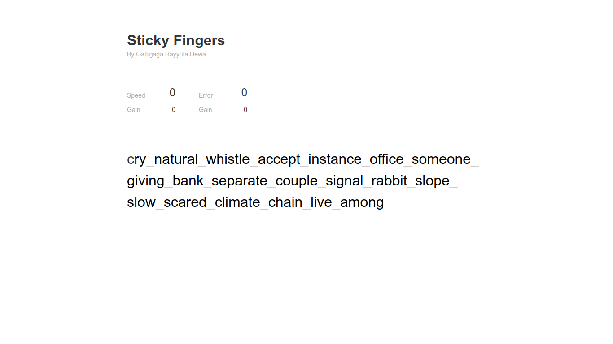

# Sticky Fingers

Sticky Fingers is an app for touch typing drill created in plain JS.



### Features

It can count your typing speed and your mistyped chars.

### Demo

https://gattigaga.github.io/sticky-fingers/

### Running

To run this project, just run this command in your Terminal :

```bash
npm install
npm start
```
